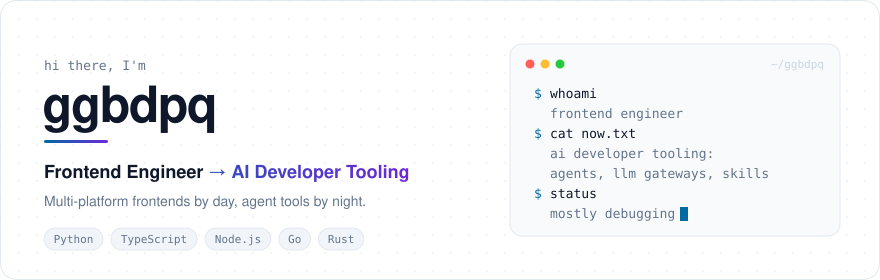
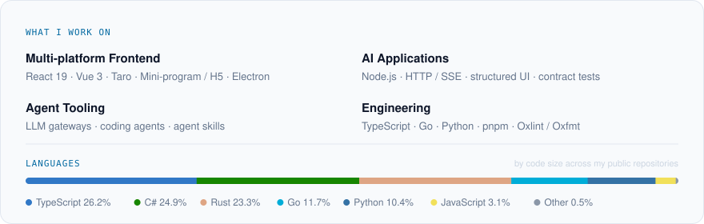
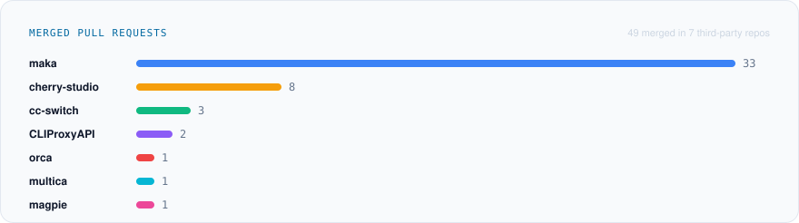

<picture><source media="(prefers-color-scheme: dark)" srcset="./assets/hero-dark.svg"></picture>

<picture><source media="(prefers-color-scheme: dark)" srcset="./assets/skills-dark.svg"></picture>

<picture>
  <source media="(prefers-color-scheme: dark)" srcset="https://github.com/ggbdpq/ggbdpq/raw/output/github-contribution-grid-snake-dark.svg">
  
</picture>

<picture>
  <source media="(prefers-color-scheme: dark)" srcset="https://github-readme-stats.vercel.app/api?username=ggbdpq&show_icons=true&custom_title=ggbdpq's%20GitHub%20Stats&theme=github_dark">
  
</picture>

<picture><source media="(prefers-color-scheme: dark)" srcset="./assets/opensource-dark.svg"></picture>

## 🛠 我的项目

- 🔌 **[qoder-proxy-api](https://github.com/ggbdpq/qoder-proxy-api)**：LLM 协议网关 · OpenAI / Anthropic 兼容 · Node 零依赖 · 89 项离线测试 · [v0.3.0](https://github.com/ggbdpq/qoder-proxy-api/releases/tag/v0.3.0)
- 🌸 **[agent-hub](https://github.com/ggbdpq/agent-hub)**：AI 应用 · React 19 · 流式 SSE · 结构化渲染 · [三层 CI](https://github.com/ggbdpq/agent-hub/actions/runs/36803101833) · [v0.1.1](https://github.com/ggbdpq/agent-hub/releases/tag/v0.1.1)
- 🤖 **[coding-agent](https://github.com/ggbdpq/coding-agent)**：Agent Runtime · 一规范五语言（TS / Go / Rust / Python / C#）· [v0.6.0](https://github.com/ggbdpq/coding-agent/releases/tag/v0.6.0)
- 🖥 **[cursor-loc](https://github.com/ggbdpq/cursor-loc)**：Cursor 界面汉化
- 🧰 **[agent-skills](https://github.com/ggbdpq/agent-skills)**：agent skills 公开合集
